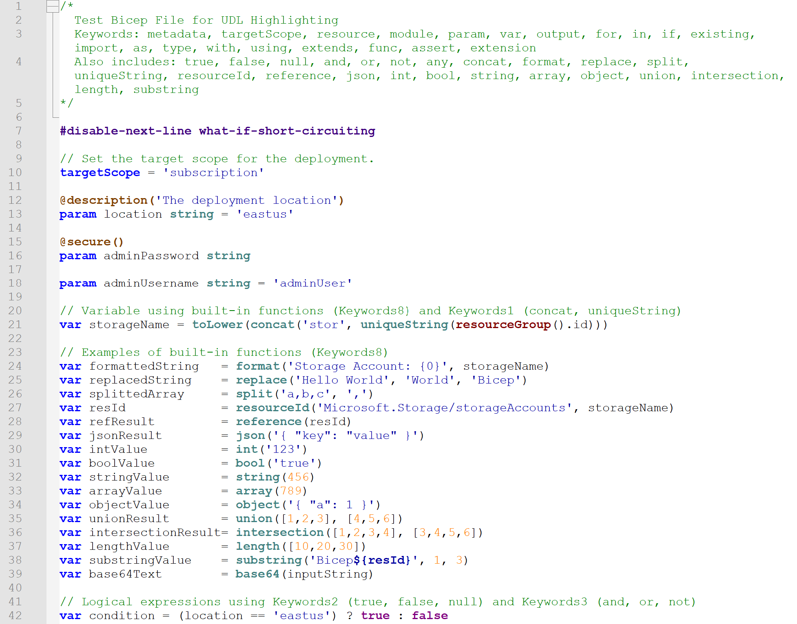

# Azure Bicep User Defined Language for Notepad++

This repository contains a [User Defined Language (UDL)](https://npp-user-manual.org/docs/user-defined-language-system/) definition for [Notepad++](https://notepad-plus-plus.org) to enable syntax highlighting for Azure Bicep files (.bicep).

## About Bicep

Bicep is a language for deploying and managing Azure cloud resources. It provides declarative syntax and simplifies the authoring experience compared to raw ARM JSON templates.
More information is available here: [What is Bicep?](https://learn.microsoft.com/en-us/azure/azure-resource-manager/bicep/overview?tabs=bicep)

## UDL Installation and Usage

1. **Download the UDL file:**  
   - [Light theme](https://raw.githubusercontent.com/richardsondev/azure-bicep-udl/main/src/Bicep-UDL.xml)  
   - [Dark theme](https://raw.githubusercontent.com/richardsondev/azure-bicep-udl/main/src/Bicep-UDL_dark.xml) (credit [@IAmCorbin](https://github.com/IAmCorbin))
2. **Open Notepad++** and go to *Language > Define your language...*
3. **Import the UDL:** Click *Import...*, select the XML file, and close the dialog.
4. **Open a Bicep file:** The syntax highlighting will now be applied.

## Screenshots

| Light Theme | Dark Theme |
|-------------|------------|
|  |  |
| [Bicep-UDL.xml](https://raw.githubusercontent.com/richardsondev/azure-bicep-udl/main/src/Bicep-UDL.xml) | [Bicep-UDL_dark.xml](https://raw.githubusercontent.com/richardsondev/azure-bicep-udl/main/src/Bicep-UDL_dark.xml) |

## Features

This UDL provides highlighting for:

*   **Keywords:** param, var, output, in, targetScope, resource, module, output, existing, import, as, type, with, using, extends, func, assert, extension
*   **Literals:** true, false, null, any
*   **Logical Operators:** and, or, not
*   **Built-in Functions:** for, if, concat, format, replace, split, uniqueString, resourceId, reference, json, int, bool, string, array, object, union, intersection, length, substring, range, toLower, base64
*   **Directives:** # prefixed directives such as `#disable-next-line`, `adminusername-should-not-be-literal`, `artifacts-parameters`, `decompiler-cleanup`, `explicit-values-for-loc-params`, and many more
*   **Additional Keywords:** resourceGroup, subscription, tenant, deployment, managementGroup, environment
*   **Operators:** `=`, `+`, `-`, `*`, `/`, `%`, `&`, `|`, `^`, `!`, `~`, `<`, `>`, `<=`, `>=`, `==`, `!=`, `??`, `:`, `?`
*   **Numbers:** Integer and decimal numbers, supporting suffixes `f, F, d, D` and scientific notation (`e, E`)
*   **Strings:** Single and double-quoted strings with escape sequence support
*   **Comments:** Single-line (`//`) and multi-line (`/* ... */`) comments
*   **Brackets and Parentheses:** `{}`, `[]`, `()`

## Work in Progress and Limitations

**This UDL is a work in progress.** Notepad++'s UDL system has limitations compared to the more advanced textmate grammars or Language Server Protocol (LSP) used in VS Code. Therefore, this UDL has the following limitations:

*   **Complex String Interpolation:** The more complex string interpolation (`${...}`) and verbatim strings (`'''`) are not fully supported. Basic string highlighting is provided, but nested expressions within strings might not be highlighted correctly.
*   **Advanced Regex:** The original Bicep grammar uses complex regular expressions that are difficult or impossible to fully replicate in Notepad++ UDLs.
*   **No Semantic Analysis:** This UDL only provides syntax highlighting based on lexical analysis. It does not provide semantic features like code completion, validation, or go-to-definition.

## Contributing

**Contributions are welcome!** If you find any issues or have improvements, please feel free to open a pull request or submit an issue.

1. When modifying syntax parsing, validate your changes using the test file at `./testfiles/sample.bicep` and add any new syntax there as appropriate.
1. Ensure that all versions of the UDL XML files remain synced (except for the UserLang Name and styling differences).

## License

This project is licensed under the [MIT License](LICENSE).
